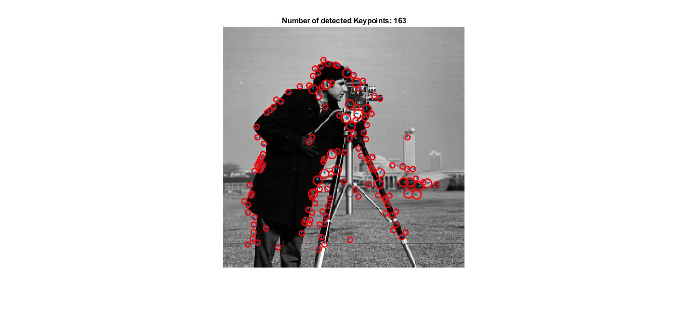

# SIFT
Pure Matlab implementation of SIFT keypoint Detection, Extraction and Matching

# Usage:
% load image 
I = imread('cameraman.tif');

% extract SIFT frames and descriptor 
[f, d] = SIFT(I);

% plot frames 
plot_descriptor(I, f)

 

# Recommendation: 
A deep explantion about SIFT can be found on 
Anatomy of the SIFT Method "http://www.ipol.im/pub/art/2014/82/article.pdf"
